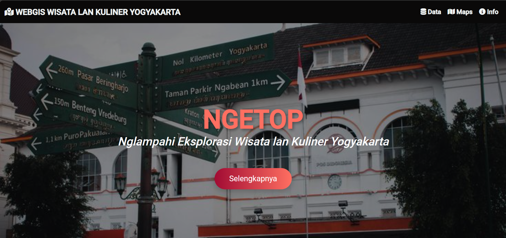
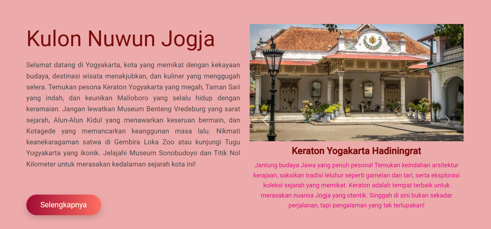
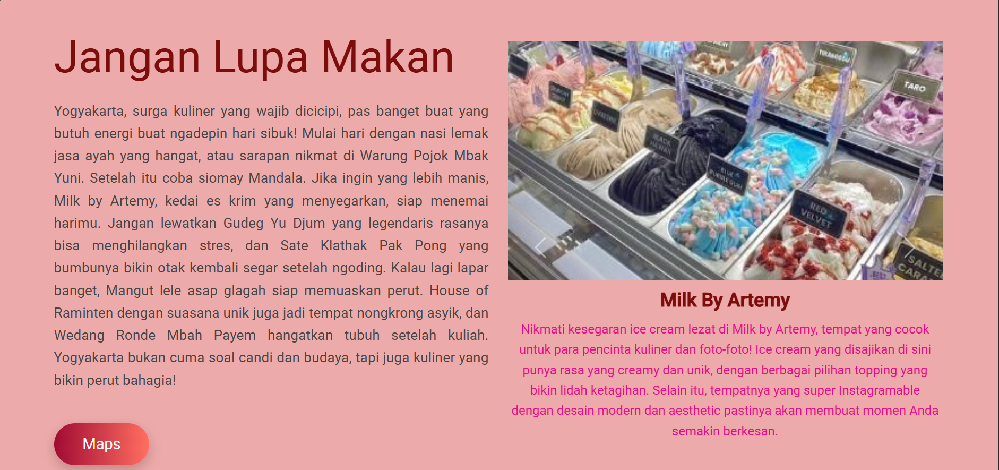
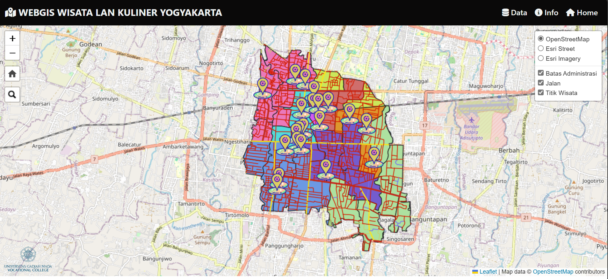
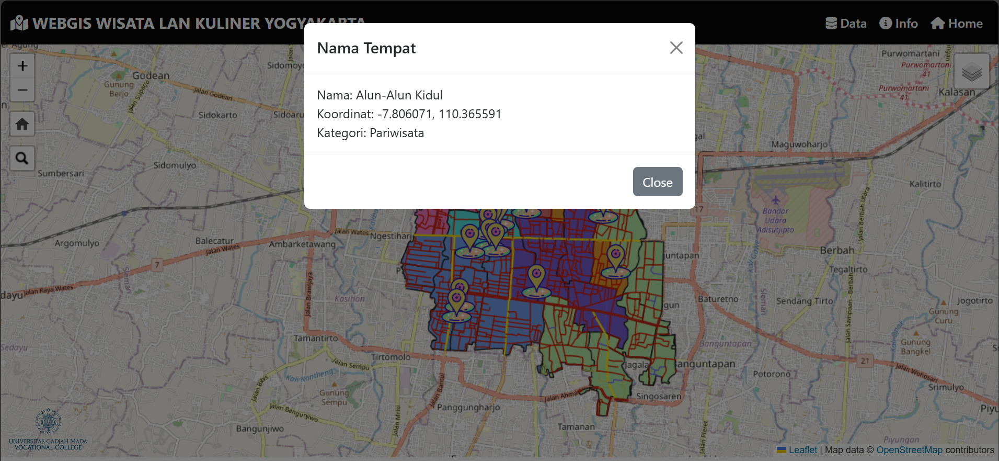
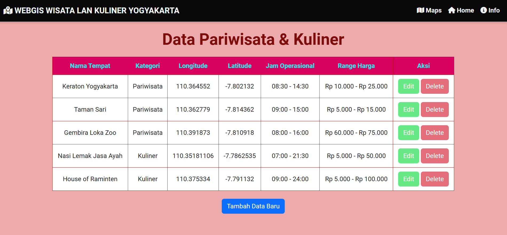
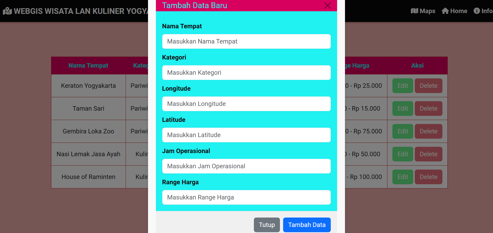
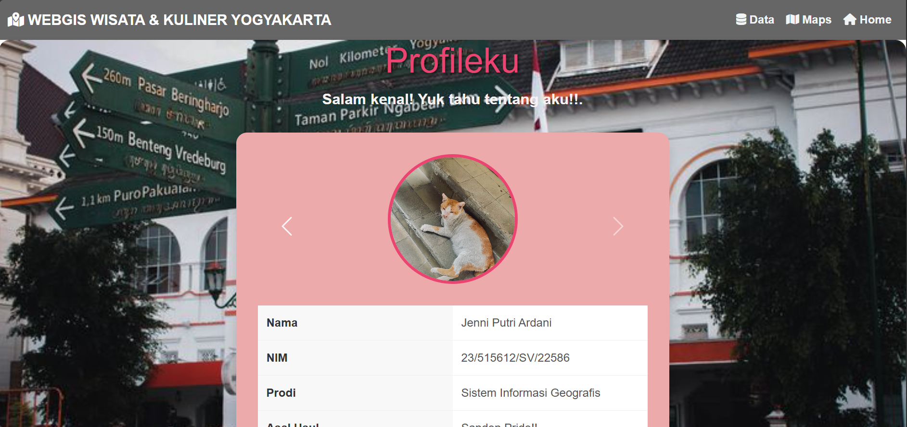

# NGETOP (Nglampahi Eksplorasi Wisata lan Kuliner Yogyakarta)
Website **NGETOP** hadir sebagai solusi modern dan praktis bagi wisatawan yang ingin mengeksplorasi keindahan wisata dan kekayaan kuliner di Yogyakarta. Mengusung konsep berbasis lokasi, website ini dirancang untuk memberikan pengalaman yang serba mudah, terutama bagi mereka yang sering kebingungan menentukan destinasi wisata atau tempat makan yang cocok.
Yogyakarta dipilih sebagai pusat perhatian karena daya tariknya yang tak tertandingi. Kota ini tidak hanya memiliki lokasi strategis dengan akses mudah dari stasiun kereta dan bandara, tetapi juga menawarkan atmosfer budaya yang khas dan destinasi yang selalu memikat hati wisatawan. Dengan NGETOP, perjalanan Anda di Yogyakarta akan menjadi lebih menyenangkan dan efisien, karena semua informasi yang Anda butuhkan ada dalam genggaman, siap memandu Anda menjelajahi setiap sudut menarik kota ini.

## KOMPONEN UTAMA NGETOP
Website NGETOP dirancang dengan empat komponen utama yang saling melengkapi, menciptakan pengalaman eksplorasi wisata dan kuliner yang praktis, modern, dan interaktif:
1. Beranda dengan Tampilan Interaktif menyajikan pengalaman yang memukau dengan carousel gambar yang menampilkan destinasi wisata dan kuliner pilihan di Yogyakarta. Setiap gambar di carousel ini mengundang pengguna untuk menjelajahi lebih dalam keindahan kota yang kaya budaya ini. Tak hanya visual yang menarik, beranda ini juga dilengkapi dengan tautan lokasi langsung, memungkinkan pengguna untuk mengakses peta interaktif dengan sekali klik. Tanpa perlu membuka aplikasi lain, pengguna bisa langsung menuju lokasi tujuan dengan mudah dan cepat, menjadikan platform ini praktis, efisien, dan tentunya sangat user-friendly!
2. Peta Interaktif yang Kaya Fitur, komponen ini menjadi pusat eksplorasi lokasi wisata dan kuliner Yogyakarta. Peta ini tidak hanya menampilkan batas administrasi, jaringan jalan, serta titik-titik wisata dan kuliner unggulan, tetapi juga dilengkapi dengan berbagai fitur canggih seperti zoom in/out untuk penyesuaian tampilan, pencarian lokasi untuk menemukan tempat dengan cepat, dan pop-up interaktif yang memberikan detail informasi setiap tempat. Fitur kontrol layer juga memungkinkan pengguna untuk menyesuaikan tampilan peta sesuai kebutuhan, seperti menampilkan lapisan batas desa atau lokasi-lokasi strategis lainnya. Dengan desain responsif dan navigasi yang efisien, platform ini menjadikan eksplorasi wisata dan kuliner semakin mudah, menyenangkan, dan bebas kebingungan. 
3. Database Informasi Lokasi, tampilan database dalam website NGETOP dirancang untuk memberikan pengalaman eksplorasi yang praktis dan informatif bagi pengguna. Dengan format tabel yang rapi dan interaktif, setiap informasi tersaji secara lengkap, mulai dari nama lokasi wisata dan kuliner, kategori tempat, hingga koordinat geografis yang memudahkan pengguna menemukan lokasi secara akurat melalui peta interaktif. Selain itu, kolom jam operasional memberikan kepastian waktu kunjungan, sedangkan range harga membantu pengguna memilih destinasi sesuai anggaran mereka. Tidak hanya itu, fitur aksi berupa tombol Edit dan Delete memungkinkan pengelolaan data menjadi lebih cepat dan fleksibel, sementara tombol Tambah Data Baru memberikan kemudahan untuk memperbarui katalog dengan informasi terbaru. 
4. Profile Pembuat, halaman ini dirancang untuk memperkenalkan profil pribadi dengan sentuhan visual yang menarik dan modern. Menampilkan foto carousel yang memukau, informasi penting tentang diri pembuat, serta tautan media sosial yang terintegrasi, halaman ini memudahkan pengunjung untuk terhubung lebih lanjut. Halaman ini memberikan cara yang praktis bagi orang lain untuk menjalin koneksi dan menjelajahi lebih banyak tentang pembuat secara online.

## KOMPONEN PENDUKUNG
Aplikasi webGIS ini menggunakan berbagai teknologi untuk membuat webGIS yang menarik dan interatif. **Leaflet** digunakan untuk peta interaktif dengan fitur pencarian lokasi dan kontrol tampilan peta yang dinamis. **Bootstrap** memastikan desain responsif dan tampilan modern dengan komponen seperti navbar, modal, dan carousel. **Font Awesome** menambah kesan visual menarik melalui ikon yang memudahkan navigasi. **jQuery** digunakan untuk memanipulasi elemen dan memuat data GeoJSON secara dinamis. Selain itu, **WMS** memungkinkan integrasi layer peta dari GeoServer, menampilkan data spasial yang relevan. Fitur utama termasuk peta interaktif, pencarian lokasi, kontrol zoom, serta tampilan informasi wisata melalui carousel. Dengan desain yang responsif dan teknologi terkini seperti **HTML5**, **CSS3**, dan **JavaScript**, aplikasi ini menawarkan antarmuka yang mudah digunakan dan diakses di berbagai perangkat.

## SUMBER DATA
1. Geoporta Kota Yogyakarta https://geoportal.jogjakota.go.id/
2. Data Shapefile Kota Yogyakarta https://www.indonesia-geospasial.com/2020/01/shp-rbi-provinsi-di-yogyakarta.html

## TAMPILAN NGETOP

